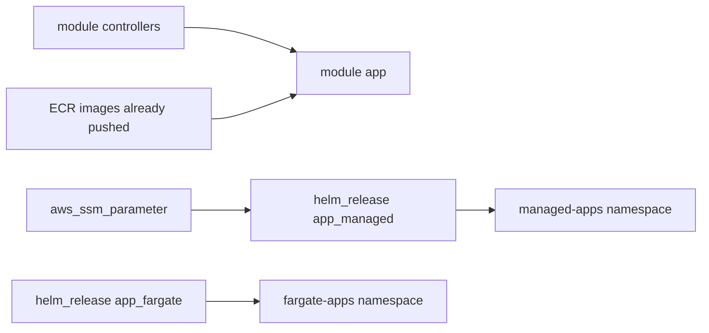

# Infrastructure: Application workloads (app module)

The **app** module deploys both PHP demo applications to the EKS cluster as Helm releases. It also creates the SSM Parameter Store entry used by `app-managed`.

**Terraform path:** [terraform/eks-infra/modules/app/](../terraform/eks-infra/modules/app/)

**Invoked from:** [terraform/eks-infra/main.tf](../terraform/eks-infra/main.tf) as `module "app"`.

**Depends on:** controllers module (`depends_on = [module.controllers]`). The AWS Load Balancer Controller must be running before Ingress resources can provision ALBs.

See also: [docs/infra.md](infra.md) | [docs/helm.md](helm.md) | [docs/app.md](app.md)

## Purpose

After the cluster and controllers are up, this module:

1. Creates an **SSM parameter** with the value for `app-managed`'s `PARAMS_STORE`.
2. Looks up both **ECR repositories** by name (images must already exist).
3. Installs **`helm/app-managed`** and **`helm/app-fargate`** as Terraform-managed Helm releases.

Application deployment is part of the same `terraform apply` in `terraform/eks-infra/` — no separate manual Helm step is required for the default workflow.

## Module dependencies



## Configuration

Set via the `app` object in [terraform/eks-infra/terraform.tfvars](../terraform/eks-infra/terraform.tfvars):

| Variable | Default in repo | Meaning |
| -------- | --------------- | ------- |
| `managed_app_ecr_repo_name` | `mvtthxw-k8s-php-dev-app-managed` | Full ECR repository name |
| `managed_app_image_tag` | `v1.0.0` | Image tag (must exist in ECR) |
| `managed_app_namespace` | `managed-apps` | Kubernetes namespace |
| `managed_app_replica_count` | `1` | Pod replicas |
| `managed_app_ssm_value` | `Example value` | SSM parameter value → `PARAMS_STORE` in the pod |
| `fargate_app_ecr_repo_name` | `mvtthxw-k8s-php-dev-app-fargate` | Full ECR repository name |
| `fargate_app_image_tag` | `v1.0.0` | Image tag (must exist in ECR) |
| `fargate_app_namespace` | `fargate-apps` | Kubernetes namespace (matches Fargate profile) |
| `fargate_app_replica_count` | `1` | Pod replicas |

The ECR repo names must match repositories created by the `terraform/ecr` stack and images pushed via `build_and_push.py`. The image tags must match tags present in ECR — apply will fail at runtime if the image cannot be pulled.

## SSM parameter (app-managed)

[ssm.tf](../terraform/eks-infra/modules/app/ssm.tf) creates:

```
/<username>/<repo>/<environment>/app-managed/PARAMS_STORE
```

Example: `/mvtthxw/k8s-php-infra/dev/app-managed/PARAMS_STORE`

The parameter value comes from `app.managed_app_ssm_value`. Terraform passes it into the Helm chart as `ssm.parameterValue`, which renders a Kubernetes `Secret` ([helm/app-managed/templates/secret.yaml](../helm/app-managed/templates/secret.yaml)). The Deployment mounts `PARAMS_STORE` from that Secret.

This is a simplified path for the demo — the Secrets Store CSI driver is installed by the controllers module but is not wired into these charts yet.

## Helm releases

| Release | Chart path | Namespace | Compute |
| ------- | ---------- | --------- | ------- |
| `app-managed` | [helm/app-managed](../helm/app-managed) | `managed-apps` | EKS managed node group |
| `app-fargate` | [helm/app-fargate](../helm/app-fargate) | `fargate-apps` | EKS Fargate (via Fargate profile) |

Chart paths are resolved relative to the module: `abspath("${path.module}/../../../../helm/...")` — see [locals.tf](../terraform/eks-infra/modules/app/locals.tf).

Terraform sets Helm values via `helm_release` `set` blocks ([helm-app-managed.tf](../terraform/eks-infra/modules/app/helm-app-managed.tf), [helm-app-fargate.tf](../terraform/eks-infra/modules/app/helm-app-fargate.tf)):

- `image.repository` — from `data.aws_ecr_repository` (live ECR URL)
- `image.tag` — from `terraform.tfvars`
- `replicaCount`, `namespace.name`, `namespace.create = false` (namespace created by Helm release with `create_namespace = true`)
- `ssm.parameterValue` — app-managed only (from SSM parameter)

## Ingress / ALB access

Both charts create an **Ingress** with `ingressClassName: alb` and a shared annotation `alb.ingress.kubernetes.io/group.name: shared-apps`. The AWS Load Balancer Controller merges them onto one internet-facing ALB with separate listener ports:

| App | ALB HTTP port | Local docker-compose port |
| --- | ------------- | ------------------------- |
| `app-fargate` | `8081` | `8081` |
| `app-managed` | `8082` | `8082` |

After apply, get the ALB hostname:

```bash
kubectl get ingress -A
# or
kubectl get ingress -n managed-apps
kubectl get ingress -n fargate-apps
```

Open `http://<alb-hostname>:8081` for `app-fargate` and `:8082` for `app-managed`.

## Outputs

Root stack re-exports from [terraform/eks-infra/modules/app/outputs.tf](../terraform/eks-infra/modules/app/outputs.tf):

| Output | Description |
| ------ | ----------- |
| `app_managed_helm_release_name` | `app-managed` |
| `app_managed_helm_release_namespace` | `managed-apps` |
| `app_managed_helm_status` | Helm release status |
| `app_managed_image` | Full `repository:tag` deployed |
| `app_managed_ssm_parameter_name` | SSM path |
| `app_fargate_helm_release_name` | `app-fargate` |
| `app_fargate_helm_release_namespace` | `fargate-apps` |
| `app_fargate_helm_status` | Helm release status |
| `app_fargate_image` | Full `repository:tag` deployed |

## Verification

```bash
kubectl get pods -n managed-apps
kubectl get pods -n fargate-apps
helm list -n managed-apps
helm list -n fargate-apps
kubectl get ingress -A
```

Expected:

- `app-managed` pod(s) on a managed node (`kubectl get nodes -L node-group-label`).
- `app-fargate` pod(s) on Fargate (no node in `kubectl get pods -o wide`, or Fargate compute type).
- Both Ingresses with an ALB address once the Load Balancer Controller reconciles them.

## Updating a deployed version

1. Bump `app/<app>/.version` and push the new image:

   ```bash
   cd app
   python3 build_and_push.py app-managed   # or app-fargate
   ```

2. Update the matching `*_app_image_tag` in [terraform/eks-infra/terraform.tfvars](../terraform/eks-infra/terraform.tfvars).

3. Re-apply:

   ```bash
   cd terraform/eks-infra
   terraform apply
   ```

To change the SSM value for `app-managed`, update `managed_app_ssm_value` and re-apply — Terraform updates the parameter and the Helm release.

## Files

| File | Role |
| ---- | ---- |
| `helm-app-managed.tf` | SSM-backed Helm release for app-managed |
| `helm-app-fargate.tf` | Helm release for app-fargate |
| `ssm.tf` | SSM parameter for PARAMS_STORE value |
| `data.tf` | ECR repository lookups |
| `locals.tf` | Chart paths, namespaces, defaults |
| `variables.tf` | `general` and `app` inputs |
| `outputs.tf` | Release and image outputs |
