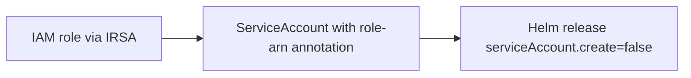

# Infrastructure: Controllers (Helm module)

The **controllers** module installs cluster add-ons via Helm charts. Each controller gets an **IRSA** IAM role, a pre-created Kubernetes ServiceAccount, and a Helm release that reuses that ServiceAccount.

**Terraform path:** [terraform/eks-infra/modules/controllers/](../terraform/eks-infra/modules/controllers/)

**Invoked from:** [terraform/eks-infra/main.tf](../terraform/eks-infra/main.tf) as `module "controllers"`.

**Depends on:** EKS module (`cluster_name`, `oidc_provider_arn`) and network module (`vpc_id`). Explicit `depends_on = [module.eks]` ensures the API server is reachable before Helm installs run.

See also: [docs/infra.md](infra.md) | [docs/infra-eks.md](infra-eks.md)

## Purpose

Install three operational controllers that the PHP apps and future Helm charts rely on:

1. **AWS Load Balancer Controller** - creates ALBs from Kubernetes Ingress resources.
2. **Cluster Autoscaler** - scales the managed node group between min and max size.
3. **Secrets Store CSI Driver + AWS Provider** - mounts secrets from SSM Parameter Store into pods (future source of `PARAMS_STORE` for `app-fargate` - see [docs/app.md](app.md)).

## Common pattern

Every controller follows the same three-step pattern:



1. **IAM role** - `terraform-aws-modules/iam/aws//modules/iam-role-for-service-accounts` v6.6.0, trusting the EKS OIDC provider for a specific namespace/service account.
2. **ServiceAccount** - created with `kubernetes_service_account_v1`, annotated with `eks.amazonaws.com/role-arn`.
3. **Helm release** - chart installed with `serviceAccount.create = false` and `serviceAccount.name` pointing at the pre-created account.

All controllers run in the **`kube-system`** namespace.

## Naming

Role name prefix: `<username>-<repo>-<environment>` ([locals.tf](../terraform/eks-infra/modules/controllers/locals.tf)):

| Controller              | IAM role suffix              |
| ----------------------- | ---------------------------- |
| ALB Controller          | `-alb-controller-role`       |
| Cluster Autoscaler      | `-ca-role`                   |
| Secrets Store CSI (AWS) | `-secrets-store-role`        |

---

## AWS Load Balancer Controller

**Files:** [helm-alb-controller.tf](../terraform/eks-infra/modules/controllers/helm-alb-controller.tf), [iam-role-alb-controller.tf](../terraform/eks-infra/modules/controllers/iam-role-alb-controller.tf)

| Setting          | Value                                              |
| ---------------- | -------------------------------------------------- |
| Helm chart       | `aws-load-balancer-controller`                     |
| Chart version    | `3.3.0`                                            |
| Repository       | `https://aws.github.io/eks-charts`                 |
| Release name     | `aws-load-balancer-controller`                     |
| Namespace        | `kube-system`                                      |
| ServiceAccount   | `aws-load-balancer-controller`                     |
| IAM policy       | `attach_load_balancer_controller_policy = true`    |

**Helm values set:**

- `clusterName` - EKS cluster name from the eks module
- `region` - AWS region from `general.region`
- `vpcId` - VPC ID from the network module
- `serviceAccount.create = false`, `serviceAccount.name = aws-load-balancer-controller`

**Use case:** expose HTTP(S) services via Kubernetes Ingress objects; the controller provisions and manages Application Load Balancers in AWS.

---

## Cluster Autoscaler

**Files:** [helm-cluster-autoscaler.tf](../terraform/eks-infra/modules/controllers/helm-cluster-autoscaler.tf), [iam-role-cluster-autoscaler.tf](../terraform/eks-infra/modules/controllers/iam-role-cluster-autoscaler.tf)

| Setting          | Value                                              |
| ---------------- | -------------------------------------------------- |
| Helm chart       | `cluster-autoscaler`                               |
| Chart version    | `9.57.0`                                           |
| Repository       | `https://kubernetes.github.io/autoscaler`          |
| Release name     | `cluster-autoscaler`                               |
| Namespace        | `kube-system`                                      |
| ServiceAccount   | `cluster-autoscaler`                               |
| IAM policy       | `attach_cluster_autoscaler_policy = true`          |

**Helm values set:**

- `autoDiscovery.clusterName` - EKS cluster name
- `awsRegion` - AWS region
- `cloudProvider = aws`
- `rbac.serviceAccount.create = false`, `rbac.serviceAccount.name = cluster-autoscaler`

**Use case:** when pods cannot be scheduled due to insufficient capacity, the autoscaler adds nodes up to `eks.node_group_max_size` (default `2`). When nodes are underutilised, it scales back down to `eks.node_group_min_size` (default `1`).

Requires the Cluster Autoscaler tags on the EKS cluster (set in the eks module - see [docs/infra-eks.md](infra-eks.md#cluster-autoscaler-tags)).

---

## Secrets Store CSI Driver + AWS Provider

**Files:** [helm-secrets-store-csi.tf](../terraform/eks-infra/modules/controllers/helm-secrets-store-csi.tf), [iam-role-secrets-store-csi.tf](../terraform/eks-infra/modules/controllers/iam-role-secrets-store-csi.tf)

Two separate Helm releases plus custom RBAC for the AWS provider.

### CSI Driver

| Setting        | Value                                                        |
| -------------- | ------------------------------------------------------------ |
| Helm chart     | `secrets-store-csi-driver`                                   |
| Chart version  | `1.6.0`                                                      |
| Repository     | `https://kubernetes-sigs.github.io/secrets-store-csi-driver/charts` |
| Release name   | `secrets-store-csi-driver`                                   |
| Namespace      | `kube-system`                                                |

**Helm values:** `syncSecret.enabled = true` (allows syncing mounted secrets to native Kubernetes Secrets).

### AWS Provider

| Setting        | Value                                                        |
| -------------- | ------------------------------------------------------------ |
| Helm chart     | `secrets-store-csi-driver-provider-aws`                      |
| Chart version  | `3.1.0`                                                      |
| Repository     | `https://aws.github.io/secrets-store-csi-driver-provider-aws` |
| Release name   | `secrets-store-csi-driver-provider-aws`                      |
| Namespace      | `kube-system`                                                |
| ServiceAccount | `secrets-store-csi-driver-provider-aws`                      |

**Helm values:**

- `awsRegion` - AWS region
- `rbac.install = false` - RBAC managed by Terraform instead
- `rbac.serviceAccountName = secrets-store-csi-driver-provider-aws`
- `secrets-store-csi-driver.install = false` - driver installed separately above

**IAM role** ([iam-role-secrets-store-csi.tf](../terraform/eks-infra/modules/controllers/iam-role-secrets-store-csi.tf)):

- Policy: `attach_external_secrets_policy = true`
- SSM scope: `arn:aws:ssm:<region>:<account_id>:parameter/*`
- Trust: `kube-system:secrets-store-csi-driver-provider-aws`

**Additional RBAC** (Terraform-managed):

- `ClusterRole` - allows `get` on `serviceaccounts`
- `ClusterRoleBinding` - binds the role to the provider ServiceAccount

**Use case:** mount values from **AWS SSM Parameter Store** into pods via a `SecretProviderClass`. This is the intended future replacement for the hard-coded `PARAMS_STORE` env var in `app-fargate` (currently set locally via `docker-compose.yml` - see [docs/app.md](app.md)).

**Install order:** driver Helm release first, then AWS provider (explicit `depends_on` in Terraform).

---

## Verification

After `terraform apply` completes and `kubectl` is configured:

```bash
# Service accounts with IRSA annotations
kubectl get sa -n kube-system | grep -E 'load-balancer|autoscaler|secrets-store'

# All Helm releases in kube-system
helm list -n kube-system

# Controller pods
kubectl get pods -n kube-system -l app.kubernetes.io/name=aws-load-balancer-controller
kubectl get pods -n kube-system -l app.kubernetes.io/name=cluster-autoscaler
kubectl get pods -n kube-system -l app=secrets-store-csi-driver
kubectl get pods -n kube-system -l app=secrets-store-csi-driver-provider-aws
```

Expected Helm releases in `kube-system`:

- `aws-load-balancer-controller`
- `cluster-autoscaler`
- `secrets-store-csi-driver`
- `secrets-store-csi-driver-provider-aws`

## Outputs

The root stack [terraform/eks-infra/outputs.tf](../terraform/eks-infra/outputs.tf) re-exports detailed outputs for each controller:

- IAM role ARN and name
- Kubernetes ServiceAccount name and namespace
- Helm release name, namespace, chart, version, and status

Useful for debugging IRSA trust issues or confirming chart versions after apply.

## Files

| File                              | Role                              |
| --------------------------------- | --------------------------------- |
| `helm-alb-controller.tf`          | ALB controller SA + Helm release  |
| `iam-role-alb-controller.tf`      | ALB controller IRSA role          |
| `helm-cluster-autoscaler.tf`      | Autoscaler SA + Helm release      |
| `iam-role-cluster-autoscaler.tf`  | Autoscaler IRSA role              |
| `helm-secrets-store-csi.tf`       | CSI driver + AWS provider + RBAC  |
| `iam-role-secrets-store-csi.tf`   | Secrets Store AWS provider IRSA   |
| `variables.tf`                    | Inputs from root / eks / network  |
| `outputs.tf`                      | Per-controller outputs            |
| `locals.tf`                       | IAM role name prefix              |
| `data.tf`                         | `aws_caller_identity` for SSM ARN |
| `versions.tf`                     | aws / helm / kubernetes providers |
