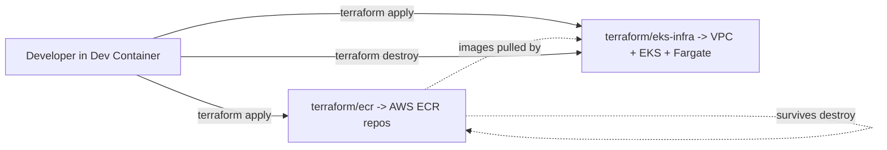

# Infrastructure

All AWS infrastructure is defined as Terraform code under [terraform/](../terraform). It is intentionally split into **two independent stacks** so the expensive part (EKS + VPC) can be torn down between work sessions while the cheap part (ECR repositories and the images stored in them) survives.

```
terraform/
├── ecr/         # AWS ECR repositories for the two apps
└── eks-infra/   # VPC + EKS cluster (managed nodes + Fargate)
```

## Why two stacks?

- **`terraform/ecr/`** - cheap to keep around. ECR storage costs are negligible and the images you've built and pushed are valuable; you don't want to lose them every time you tear down the cluster.
- **`terraform/eks-infra/`** - the expensive part. An EKS control plane and a NAT gateway both bill by the hour, so this stack is designed to be applied at the start of a session and destroyed at the end.

Splitting them means a `terraform destroy` on `eks-infra` doesn't touch ECR. When you next come back, you `terraform apply` the EKS stack and the existing images are immediately available.



## `terraform/ecr/`

Creates one ECR repository per app, named by convention `<username>-<repo>-<environment>-<short>`. The short names come from `repository_names` in [terraform/ecr/terraform.tfvars](../terraform/ecr/terraform.tfvars) (`app-managed`, `app-fargate`).

Per repository ([terraform/ecr/ecr.tf](../terraform/ecr/ecr.tf)):

- AES256 encryption at rest.
- Image vulnerability scanning on push (`scan_on_push = true`).
- Lifecycle policy that keeps only the last `var.max_image_count` images (default `5`).
- `force_delete = false`, so `terraform destroy` will refuse if the repo still has images - intentional safety net.

Outputs ([terraform/ecr/outputs.tf](../terraform/ecr/outputs.tf)) expose:

- `repository_urls` - map of short name -> full ECR URI (use these when tagging images for `docker push`).
- `repository_arns` - same map but ARNs.
- `registry_id` - the AWS account ID hosting the registry.

## `terraform/eks-infra/`

Three pieces:

### VPC ([terraform/eks-infra/vpc.tf](../terraform/eks-infra/vpc.tf))

Built with the upstream `terraform-aws-modules/vpc/aws` module (v6.6.1):

- `var.az_count` Availability Zones (default `2`).
- One public + one private subnet per AZ, carved out of `var.cidr` (`10.100.0.0/20`).
- A **single NAT gateway** (cost optimisation - one NAT instead of one per AZ).
- Public IPs auto-assigned in public subnets.

### EKS cluster ([terraform/eks-infra/eks.tf](../terraform/eks-infra/eks.tf))

Built with `terraform-aws-modules/eks/aws` v21.20.0:

- Cluster name: `<username>-<repo>-<environment>-eks`.
- Kubernetes version from `var.cluster_version` (`1.35`).
- Worker subnets: the private subnets created by the VPC module.
- IRSA enabled (`enable_irsa = true`), so service accounts can assume IAM roles.
- Cluster creator gets admin access (`enable_cluster_creator_admin_permissions = true`).
- One **managed node group** `mvtthxw_group`: 1 x `t3.medium`, 20 GB disk, on-demand.
- One **Fargate profile** `default` selecting the `fargate-apps` namespace.
- Addons installed and pinned to "most recent": `vpc-cni` (with the dedicated IRSA role from `iam-role-vpc-cni.tf`), `coredns`, `kube-proxy`.
- Node security group has additional ingress rules for ports `80` and `443` from anywhere.

### IAM role for the VPC CNI ([terraform/eks-infra/iam-role-vpc-cni.tf](../terraform/eks-infra/iam-role-vpc-cni.tf))

Built with `terraform-aws-modules/iam/aws//modules/iam-role-for-service-accounts` v6.6.0. Trusts the EKS OIDC provider for the `kube-system:aws-node` service account, attaches the AWS-managed VPC CNI policy. This role is wired into the `vpc-cni` addon via `service_account_role_arn`.

## Remote state

Both stacks use the same S3 backend bucket `mvtthxw-tf-state` in `us-east-1`, with separate state keys so they don't collide:

| Stack                  | State key                              | File                                                        |
| ---------------------- | -------------------------------------- | ----------------------------------------------------------- |
| `terraform/ecr`        | `state/k8s-php-ecr.tfstate`            | [versions.tf](../terraform/ecr/versions.tf)                 |
| `terraform/eks-infra`  | `state/k8s-php-eks-infra.tfstate`      | [versions.tf](../terraform/eks-infra/versions.tf)           |

Default tags (`Owner`, `Repo`, `Environment`, `ManagedBy = Terraform`) are applied to every resource via the `aws` provider's `default_tags` block in each stack.

## Standard workflow

Each stack is operated independently from its own folder:

```bash
cd terraform/<stack>     # ecr or eks-infra
terraform init
terraform plan
terraform apply
```

### Recommended order

1. **Apply `ecr` first** so the repositories exist and you can push images to them.
2. **Apply `eks-infra` second** to bring up the cluster.
3. Build and push images, deploy workloads, do your work.
4. **Destroy `eks-infra` when done** to stop the EKS / NAT bill:

```bash
cd terraform/eks-infra
terraform destroy
```

ECR is untouched by step 4, so the images stay available for the next session.

## Connecting `kubectl` after apply

Once `eks-infra` has finished applying, point your local kubeconfig at the new cluster:

```bash
aws eks update-kubeconfig \
  --name <cluster_name> \
  --region us-east-1
```

The exact `<cluster_name>` is `<username>-<repo>-<environment>-eks` based on the values in [terraform/eks-infra/terraform.tfvars](../terraform/eks-infra/terraform.tfvars), and is also surfaced in the stack outputs (`cluster_id`, `cluster_endpoint`, `oidc_issuer_url`, ...) - see [terraform/eks-infra/outputs.tf](../terraform/eks-infra/outputs.tf).

After that, `kubectl get nodes` should list the managed node group node, and `kubectl get pods -A` should show the addons running.
