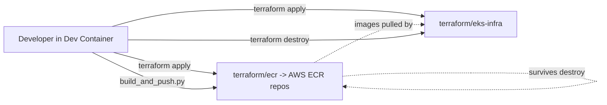
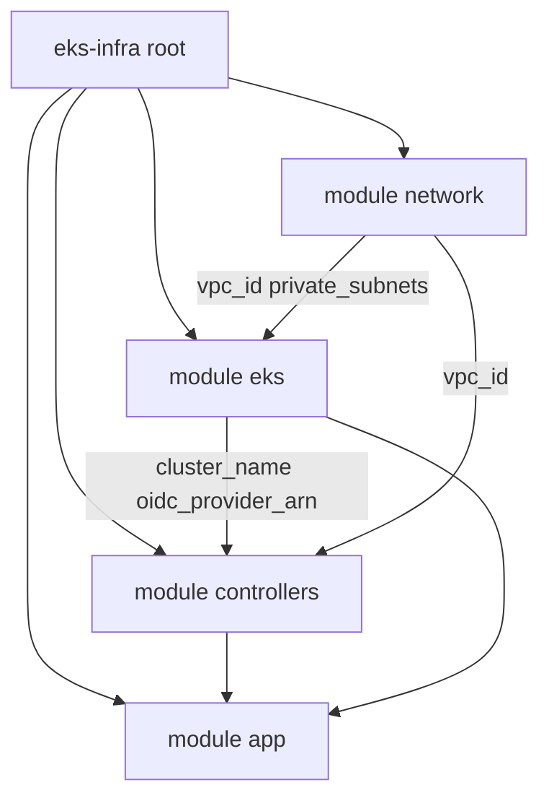

# Infrastructure

All AWS infrastructure is defined as Terraform code under [terraform/](../terraform). It is intentionally split into **two independent stacks** so the expensive part (EKS + VPC + controllers + apps) can be torn down between work sessions while the cheap part (ECR repositories and the images stored in them) survives.

```
terraform/
├── ecr/         # AWS ECR repositories for the two apps
└── eks-infra/   # VPC + EKS + controllers + application Helm releases
```

## Why two stacks?

- **`terraform/ecr/`** - cheap to keep around. ECR storage costs are negligible and the images you've built and pushed are valuable; you don't want to lose them every time you tear down the cluster.
- **`terraform/eks-infra/`** - the expensive part. An EKS control plane, NAT gateway and running nodes all bill by the hour, so this stack is designed to be applied at the start of a session and destroyed at the end.

Splitting them means a `terraform destroy` on `eks-infra` doesn't touch ECR. When you next come back, you `terraform apply` the EKS stack and the existing images are immediately available.



## `terraform/ecr/`

Creates one ECR repository per app, named by convention `<username>-<repo>-<environment>-<short>`. The short names come from `repository_names` in [terraform/ecr/terraform.tfvars](../terraform/ecr/terraform.tfvars) (`app-managed`, `app-fargate`).

Per repository ([terraform/ecr/ecr.tf](../terraform/ecr/ecr.tf)):

- AES256 encryption at rest.
- Image vulnerability scanning on push (`scan_on_push = true`).
- Lifecycle policy that keeps only the last `var.max_image_count` images (default `5`).
- `force_delete = false`, so `terraform destroy` will refuse if the repo still has images - intentional safety net.

Outputs ([terraform/ecr/outputs.tf](../terraform/ecr/outputs.tf)) expose:

- `repository_urls` - map of short name -> full ECR URI (use these when tagging images for `docker push`).
- `repository_arns` - same map but ARNs.
- `registry_id` - the AWS account ID hosting the registry.

## `terraform/eks-infra/` overview

The EKS stack is organised as four Terraform modules orchestrated from [terraform/eks-infra/main.tf](../terraform/eks-infra/main.tf):

```
terraform/eks-infra/
├── main.tf              # orchestrates 4 modules
├── variables.tf         # general / vpc / eks / app objects
├── terraform.tfvars
├── versions.tf          # aws + kubernetes + helm providers
├── outputs.tf           # re-exports from all modules
└── modules/
    ├── network/         # VPC
    ├── eks/             # EKS cluster + addons + VPC CNI IRSA
    ├── controllers/     # Helm: ALB, Cluster Autoscaler, Secrets Store CSI
    └── app/             # Helm: app-managed + app-fargate + SSM parameter
```

### Module dependencies

A single `terraform apply` creates resources in this order:



1. **network** - VPC, subnets, NAT gateway (no cluster dependency).
2. **eks** - EKS control plane, node group, Fargate profile, core addons (needs VPC outputs).
3. **controllers** - Helm releases for cluster add-ons (needs EKS API endpoint and OIDC provider).
4. **app** - SSM parameter + Helm releases for both PHP apps (needs ALB controller and ECR images).

The root stack configures **kubernetes** and **helm** providers ([versions.tf](../terraform/eks-infra/versions.tf)) using the EKS cluster endpoint and auth token.

### Configuration format

Variables are grouped into objects in [terraform/eks-infra/terraform.tfvars](../terraform/eks-infra/terraform.tfvars):

```hcl
general = {
  username    = "mvtthxw"
  repo        = "k8s-php-infra"
  region      = "us-east-1"
  environment = "dev"
}

vpc = {
  cidr     = "10.100.0.0/20"
  az_count = 2
}

eks = {
  cluster_version           = "1.36"
  node_group_disk_size      = 20
  node_group_min_size       = 1
  node_group_max_size       = 3
  node_group_desired_size   = 1
  node_group_instance_types = ["t4g.medium"]
}

app = {
  managed_app_ecr_repo_name = "mvtthxw-k8s-php-dev-app-managed"
  managed_app_image_tag     = "v1.0.0"
  managed_app_namespace     = "managed-apps"
  managed_app_replica_count = 1
  managed_app_ssm_value     = "Example value"

  fargate_app_ecr_repo_name = "mvtthxw-k8s-php-dev-app-fargate"
  fargate_app_image_tag     = "v1.0.0"
  fargate_app_namespace     = "fargate-apps"
  fargate_app_replica_count = 1
}
```

Default tags (`Owner`, `Repo`, `Environment`, `ManagedBy = Terraform`) are applied to every AWS resource via the `aws` provider's `default_tags` block.

### Detailed module documentation

- [docs/infra-vpc.md](infra-vpc.md) - VPC / network module (`modules/network/`)
- [docs/infra-eks.md](infra-eks.md) - EKS cluster module (`modules/eks/`)
- [docs/infra-controllers.md](infra-controllers.md) - Helm controllers (`modules/controllers/`)
- [docs/infra-app.md](infra-app.md) - Application Helm releases + SSM (`modules/app/`)
- [docs/helm.md](helm.md) - Local Helm chart reference (`helm/`)

## Remote state

Both stacks use the same S3 backend bucket `mvtthxw-tf-state` in `us-east-1`, with separate state keys so they don't collide:

| Stack                 | State key                         | File                                              |
| --------------------- | --------------------------------- | ------------------------------------------------- |
| `terraform/ecr`       | `state/k8s-php-ecr.tfstate`       | [versions.tf](../terraform/ecr/versions.tf)       |
| `terraform/eks-infra` | `state/k8s-php-eks-infra.tfstate` | [versions.tf](../terraform/eks-infra/versions.tf) |

## Standard workflow

Each stack is operated independently from its own folder:

```bash
cd terraform/<stack>     # ecr or eks-infra
terraform init
terraform plan
terraform apply
```

### Recommended order

1. **Apply `ecr`** so the repositories exist:

   ```bash
   cd terraform/ecr
   terraform apply
   ```

2. **Build and push images** to ECR (see [docs/app.md](app.md)). Tags must match `app.*_app_image_tag` in `terraform.tfvars`:

   ```bash
   cd app
   python3 build_and_push.py
   ```

3. **Apply `eks-infra`** to bring up VPC, EKS, controllers, and both apps in one run:

   ```bash
   cd terraform/eks-infra
   terraform apply
   ```

   This step can take a while (cluster creation, node group, multiple Helm releases). Timeouts are set to up to 45 minutes for the cluster and node group - do not interrupt the apply.

4. **Verify** apps are reachable via the shared ALB (see [docs/infra-app.md](infra-app.md#ingress--alb-access)).

5. **Destroy `eks-infra` when done** to stop the EKS / NAT / node bill:

   ```bash
   cd terraform/eks-infra
   terraform destroy
   ```

   ECR is untouched, so the images stay available for the next session.

## Connecting `kubectl` after apply

Once `eks-infra` has finished applying, point your local kubeconfig at the new cluster:

```bash
aws eks update-kubeconfig \
  --name <cluster_name> \
  --region us-east-1
```

The cluster name is `<username>-<repo>-<environment>-eks` based on the `general` block in [terraform/eks-infra/terraform.tfvars](../terraform/eks-infra/terraform.tfvars) (e.g. `mvtthxw-k8s-php-infra-dev-eks`). It is also surfaced in stack outputs - see [terraform/eks-infra/outputs.tf](../terraform/eks-infra/outputs.tf).

### Verification checklist

```bash
kubectl get nodes
kubectl get pods -n kube-system
helm list -n kube-system
kubectl get pods -n managed-apps
kubectl get pods -n fargate-apps
kubectl get ingress -A
```

After that:

- `kubectl get nodes` should list ARM managed node group nodes (`t4g.medium`).
- `kubectl get pods -n kube-system` should show core addons and controller pods running.
- `helm list -n kube-system` should list the AWS Load Balancer Controller, Cluster Autoscaler, and Secrets Store CSI releases.
- `kubectl get pods -n managed-apps` and `-n fargate-apps` should show the PHP app pods.
- `kubectl get ingress -A` should show ALB hostnames for both apps.

See [docs/infra-controllers.md](infra-controllers.md) and [docs/infra-app.md](infra-app.md) for module-specific verification.
